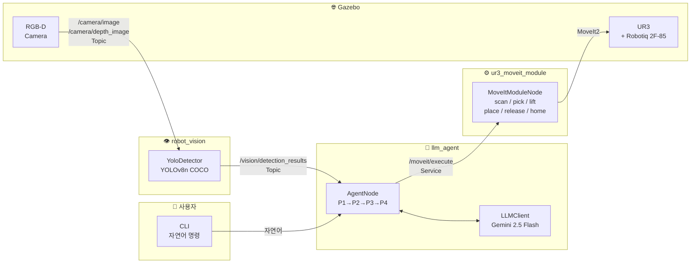

# Arm_Module_Assembler

> **UR3 robot arm × LLM** 제어 프로젝트의 **통합(Integration) 메인 레포**.  
> 각 팀이 개별 개발한 모듈(LLM Agent / YOLO Vision / MoveIt / 로봇모델·시뮬)을
> 하나의 Gazebo 편의점 선반 시나리오로 통합한 기준 레포입니다.

## 시스템 개요

CLI 자연어 명령 → LLM이 의도 파싱 → YOLO가 선반 위 콜라캔 탐지·3D좌표 변환 → MoveIt이 Pick & Place 계획·실행



> 전체 상세 다이어그램(노드 통신 구조 · 시퀀스 · 예외 처리 흐름): [docs/ARCHITECTURE_DIAGRAM.md](docs/ARCHITECTURE_DIAGRAM.md)

## 모듈 현황

| 모듈 | 레포 | 통합 브랜치 | 상태 |
|------|------|------------|------|
| LLM Agent | `ROS2bootcamp/LLM_Agent` | `fix/agent-frame-params` | ✅ 통합 완료 |
| YOLO Vision | `ROS2bootcamp/ROBOT_VISION` | `feat/integration` | ✅ 통합 완료 |
| MoveIt 실행 | `ROS2bootcamp/Moveit_module` | `feat/service-interface` | ✅ 통합 완료 |
| MoveIt 환경 | `ROS2bootcamp/PANDA_ENV` | `fix/srdf-group-name` | ✅ 통합 완료 |
| 테스트 환경 | `ROS2bootcamp/UR3_CONVENIENCE_ENV` | `feat/model-dirs-and-integrated-world` | ✅ 통합 완료 |

---

## 즉시 테스트 가이드

> **이 레포 하나로 모든 것이 포함됩니다.** `src/` 에 전체 ROS 2 패키지, `src/ur3_mtc_pick_place/models/` 에 Gazebo 모델이 내장되어 있습니다. 별도 레포 클론 불필요.

```bash
# 1. 클론
git clone https://github.com/ROS2bootcamp/Arm_Module_Assembler.git
cd Arm_Module_Assembler

# 2. 전체 환경 설정 (1회 — apt/pip 설치 + 빌드 + API 키)
bash scripts/setup.sh

# 3-A. 시뮬레이션 스택 기동 (터미널 1)
bash scripts/run_stack.sh

# 3-B. LLM Agent 실행 (터미널 2, 스택 기동 후)
bash scripts/run_agent.sh
```

---

### 1. 사전 요구사항

**OS / ROS 2 스택**

```bash
# Ubuntu 22.04 + ROS 2 Humble
sudo apt update
sudo apt install -y \
  ros-humble-moveit \
  ros-humble-moveit-task-constructor-core \
  ros-humble-moveit-task-constructor-demo \
  ros-humble-moveit-task-constructor-capabilities \
  ros-humble-ur-simulation-gz \
  ros-humble-ros-gz-bridge \
  ros-humble-ros-gz-sim \
  ros-humble-gz-ros2-control \
  ros-humble-robotiq-description \
  ros-humble-cv-bridge \
  ros-humble-tf2-ros \
  ros-humble-robot-state-publisher
```

**Python 패키지**

```bash
pip3 install google-genai python-dotenv ultralytics
```

**Gemini API 키** (https://aistudio.google.com 에서 발급)

---

### 2. 레포 구조

이 레포는 **모노레포 ROS 2 워크스페이스**입니다. 별도 레포 클론 없이 이 레포 하나로 완전한 시스템을 구성합니다.

```
Arm_Module_Assembler/         ← colcon 워크스페이스 루트
├── src/
│   ├── llm_agent_msgs/       LLM ↔ MoveIt 서비스 인터페이스
│   ├── llm_agent/            LLM 에이전트 (Gemini + P1~P4 Pick & Place)
│   ├── ur3_mtc_pick_place/   UR3 환경 패키지
│   │   ├── models/           Gazebo 모델 (선반·콜라캔·디스트랙터·카메라)
│   │   └── worlds/           통합 씬 SDF (ur3_pick_place.sdf)
│   ├── ur3_moveit_module/    MoveIt2 + MTC 실행 서비스
│   └── robot_vision/         YOLO v8 탐지 노드
├── scripts/                  자동화 스크립트
├── docs/                     설계 결정 문서
└── .env                      API 키 (gitignore, setup.sh 가 생성)
```

**Gazebo 씬 구성:**

| 오브젝트 | YOLO 클래스 | 역할 |
|---------|------------|------|
| Coke Can | `bottle` | **타겟** — 에이전트가 집는 대상 |
| Soccer Ball | `sports ball` | 디스트랙터 |
| Toaster | `toaster` | 디스트랙터 |

최종 디렉터리 구조:

```
$WS/
├── PANDA_ENV/          ← ur3_mtc_pick_place 패키지 (URDF·SRDF·launch)
├── Moveit_module/      ← ur3_moveit_module + llm_agent_msgs 패키지
├── LLM_Agent/          ← llm_agent 패키지
├── ROBOT_VISION/       ← robot_vision 패키지
└── UR3_CONVENIENCE_ENV/← Gazebo 모델·월드 (ROS 패키지 아님)
```

---

### 3. 빌드

```bash
cd $WS
source /opt/ros/humble/setup.bash

# llm_agent_msgs 먼저 빌드 (다른 패키지가 의존)
colcon build --packages-select llm_agent_msgs --symlink-install

# 나머지 패키지 빌드
colcon build --packages-select \
  ur3_mtc_pick_place \
  ur3_moveit_module \
  robot_vision \
  llm_agent \
  --symlink-install

source $WS/install/setup.bash
```

> **빌드 에러 발생 시 체크리스트**
> - `robotiq_description` 미설치: `sudo apt install ros-humble-robotiq-description`
> - 빈 폴더로 인한 CMake 오류: `mkdir -p` 로 누락 폴더 생성 후 재빌드
> - 캐시 문제: `rm -rf build/ install/ log/` 후 재빌드

---

### 4. 환경 설정

**4-1. Gemini API 키 설정**

```bash
# $WS 또는 agent_node 실행 디렉터리에 .env 파일 생성
cat > $WS/.env << 'EOF'
GEMINI_API_KEY=여기에_발급받은_API_키_입력
EOF
```

> `load_dotenv()`는 CWD 및 상위 디렉터리를 자동 탐색합니다.  
> 또는 환경 변수로 직접 설정: `export GEMINI_API_KEY=<키>`

**4-2. UR3_CONVENIENCE_ENV 경로 설정**

```bash
# 기본값: ~/WorkspaceMain/UR3_CONVENIENCE_ENV
# 워크스페이스 경로가 다를 경우 아래 줄을 ~/.bashrc 에 추가
export UR3_CONVENIENCE_ENV_PATH=$WS/UR3_CONVENIENCE_ENV
```

> launch 파일이 `IGN_GAZEBO_RESOURCE_PATH`를 자동으로 설정하므로  
> **`UR3_CONVENIENCE_ENV_PATH`만 지정하면** 나머지는 자동 처리됩니다.

---

### 5. 실행

> 각 터미널에서 반드시 `source $WS/install/setup.bash` 를 먼저 실행하세요.

**터미널 1 — 전체 시뮬레이션 스택 기동**

```bash
source /opt/ros/humble/setup.bash && source $WS/install/setup.bash
export UR3_CONVENIENCE_ENV_PATH=$WS/UR3_CONVENIENCE_ENV

ros2 launch ur3_mtc_pick_place ur3_integrated.launch.py
```

기동되는 컴포넌트:
- Ignition Gazebo (편의점 선반 + 콜라캔 + 고정 RGB-D 카메라)
- UR3 + Robotiq 2F-85 ros2_control
- MoveGroup (MoveIt2 / MTC)
- RViz2
- Moveit_module 서비스 서버 (`/moveit/execute`)
- YOLO 탐지 노드 (`/vision/detection_results`)
- ros_gz_bridge (카메라 이미지·depth·camera_info·clock)
- Static TF (`world→base_link`, `base_link→camera_link`)

**Gazebo가 완전히 기동된 후** 터미널 2를 실행합니다 (약 20~30초 대기).

**터미널 2 — LLM Agent 실행**

```bash
source /opt/ros/humble/setup.bash && source $WS/install/setup.bash
cd $WS   # .env 파일 위치
ros2 run llm_agent agent_node
```

**터미널 2 — 대화 예시**

```
> 콜라캔 집어줘
> pick up the coke can
> 선반에 있는 병 집어서 옮겨줘
```

---

### 6. 동작 확인

**YOLO 탐지 확인** (새 터미널)

```bash
source $WS/install/setup.bash
ros2 topic echo /vision/detection_results
```

정상 출력 예시:
```json
{
  "timestamp_ns": 1234567890,
  "num_detections": 1,
  "objects": [{
    "class_name": "bottle",
    "confidence": 0.87,
    "position_3d_base_frame": {"X": 0.55, "Y": 0.0, "Z": 0.42}
  }]
}
```

> `class_name: "bottle"` = 콜라캔 (YOLOv8n COCO 클래스 매핑)  
> `Z ≈ 0.42` = 선반(z=0.34m) 위 캔 중심 높이 (예상값)

**카메라 토픽 확인**

```bash
ros2 topic list | grep camera
# 기대 출력:
# /camera/image
# /camera/depth_image
# /camera/image/camera_info
```

**TF 트리 확인**

```bash
ros2 run tf2_tools view_frames
# 또는
ros2 run tf2_ros tf2_echo base_link camera_link
```

**MoveIt 서비스 확인**

```bash
ros2 service list | grep moveit
# /moveit/execute 가 있어야 함

# 수동 테스트 (scan 명령)
ros2 service call /moveit/execute llm_agent_msgs/srv/MoveItExecute \
  '{cmd: "scan", params_json: "{}"}'
```

---

### 7. 시나리오 흐름 (P1 ~ P4)

| 단계 | 에이전트 동작 | 관찰 포인트 |
|------|-------------|------------|
| **P1 Scan** | 로봇 팔이 scan waypoint 이동 | Gazebo에서 팔 움직임, YOLO가 `bottle` 탐지 |
| **P2 Detect** | YOLO 결과에서 콜라캔 좌표 추출 | `/vision/detection_results` 로그 확인 |
| **P3 Pick** | MoveIt이 선반 위 캔으로 접근·파지 | Gazebo에서 그리퍼 닫힘 |
| **P4 Place** | 지정 위치(x=0.4, y=-0.2)에 내려놓음 | Gazebo에서 그리퍼 열림·캔 배치 |

---

### 8. 시뮬레이션 환경 파라미터

| 파라미터 | 값 | 설명 |
|---------|-----|------|
| 선반 위치 | x=0.55, y=0.0, z=-0.05, yaw=90° | `convenience_shelf` 스폰 좌표 (README 기준) |
| 선반 표면 높이 | z = 0.34 m | 월드 좌표계 기준 |
| 콜라캔 link_z | 0.57 m | 캔 바닥이 선반 표면(z=0.34)에 닿는 위치 |
| 콜라캔 중심 높이 | z ≈ 0.42 m | YOLO 탐지 기대값 |
| 카메라 위치 | x=1.2, y=0.0, z=0.5 | 고정 RGB-D, -X 방향 향함 |
| 카메라 TF | roll=-π/2, pitch=0, yaw=+π/2 | `base_link → camera_link` |
| 배치 목표 | x=0.4, y=-0.2, z=0.08 | `targets.yaml` 기준 |

**카메라 TF 튜닝이 필요한 경우:**

```bash
ros2 launch ur3_mtc_pick_place ur3_integrated.launch.py \
  camera_x:=1.2 camera_z:=0.5 \
  camera_roll:=-1.5708 camera_pitch:=0.0 camera_yaw:=1.5708
```

---

### 9. 스크립트 목록

| 스크립트 | 용도 | 실행 횟수 |
|----------|------|----------|
| `scripts/setup.sh` | 전체 환경 설정 (apt/pip 설치 + 클론 + 빌드 + `.env` 생성) | 1회 |
| `scripts/build.sh` | 워크스페이스 재빌드 (`--clean` 옵션으로 전체 재빌드) | 코드 변경 시 |
| `scripts/run_stack.sh` | 시뮬레이션 전체 스택 기동 (터미널 1) | 매 테스트 |
| `scripts/run_agent.sh` | LLM Agent 실행 (터미널 2) | 매 테스트 |
| `scripts/verify.sh` | 노드·토픽·TF·서비스 동작 검증 | 스택 기동 후 확인 |
| `scripts/debug.sh` | 비전·에이전트 통합 디버그 세션 (tmux 4분할) | 문제 발생 시 |
| `scripts/debug_vision.py` | 탐지 결과·카메라 Hz 실시간 모니터 (단독 실행 가능) | 비전 디버깅 |
| `scripts/debug_agent.py` | P1~P4 단계·MoveIt 응답 실시간 모니터 (단독 실행 가능) | 에이전트 디버깅 |

#### 디버그 세션 실행 예시

```bash
# tmux 4분할 통합 세션 (비전 + 에이전트 + raw echo + 자유 쉘)
bash scripts/debug.sh

# 로그 파일 저장 + ros2bag 녹화
bash scripts/debug.sh --save-log --record

# 비전만 단독 모니터
python3 scripts/debug_vision.py --save-log

# 에이전트만 단독 모니터
python3 scripts/debug_agent.py --save-log
```

> 로그 파일은 `Arm_Module_Assembler/logs/` 에 `vision_YYYYMMDD_HHMMSS.log` /
> `agent_YYYYMMDD_HHMMSS.log` 형식으로 저장됩니다.

---

### 10. 트러블슈팅

**Gazebo 모델 로드 실패** (`model://convenience_shelf not found`)

```bash
# UR3_CONVENIENCE_ENV_PATH가 올바르게 설정되었는지 확인
echo $UR3_CONVENIENCE_ENV_PATH
ls $UR3_CONVENIENCE_ENV_PATH/models/
# convenience_shelf/, coke_can/, fixed_rgbd_camera/ 가 있어야 함
```

**YOLO 탐지 없음** (`num_detections: 0`)

1. 카메라 이미지 확인: `ros2 topic hz /camera/image` (30 Hz 기대)
2. DISPLAY가 없는 경우 headless 모드 확인: `export DISPLAY` 미설정 시 자동 headless
3. camera_info 수신 확인: `ros2 topic hz /camera/image/camera_info`
4. TF 확인: `ros2 run tf2_ros tf2_echo base_link camera_link`

**`/moveit/execute` 서비스 없음**

```bash
# Moveit_module이 제대로 기동되었는지 확인
ros2 node list | grep moveit_module
```

**MoveIt IK 실패** (`ur3_manipulator` 그룹 없음 오류)

SRDF가 `name:=ur` (not `ur3`) 으로 생성되어야 함:
```bash
# 현재 그룹명 확인
ros2 param get /move_group robot_description_semantic | grep "group name"
# <group name="ur_manipulator"> 가 있어야 함
```

**API 키 오류** (`GEMINI_API_KEY not set`)

```bash
ls -la $WS/.env        # .env 파일 존재 확인
cat $WS/.env           # GEMINI_API_KEY=... 내용 확인
# 또는 환경 변수 직접 설정:
export GEMINI_API_KEY=<발급한_키>
```

**빌드 에러 — `robotiq_description` 미설치**

```bash
sudo apt install ros-humble-robotiq-description
```

---

## 문서

| 문서 | 내용 |
|------|------|
| [docs/ARCHITECTURE_DIAGRAM.md](docs/ARCHITECTURE_DIAGRAM.md) | **전체 아키텍처 다이어그램** (시스템 구조 · 통신 · 시퀀스 · 예외 처리 흐름) |
| [docs/DECISIONS.md](docs/DECISIONS.md) | 모든 통합 결정사항(D1~D18), 레포별 수정 액션, 구현 상태 |
| [docs/INTERFACE_CONTRACT.md](docs/INTERFACE_CONTRACT.md) | 토픽/서비스/프레임/좌표 규약 단일 진실원천(SSOT) |
| [docs/MOVEIT_MODULE_INTEGRATION.md](docs/MOVEIT_MODULE_INTEGRATION.md) | Moveit_module 전송 서비스화 구조 정립 |
| [docs/INTEGRATION_ANALYSIS.md](docs/INTEGRATION_ANALYSIS.md) | 모듈별 상세 분석, 인터페이스, 통합 이슈 전수 |
| [docs/INTEGRATION_STRATEGY.md](docs/INTEGRATION_STRATEGY.md) | 단계별 통합 로드맵 + 목표 워크스페이스 구조 |

---

## 공통 스택

| 항목 | 버전 / 내용 |
|------|------------|
| OS | Ubuntu 22.04 |
| ROS 2 | Humble |
| Gazebo | Ignition Fortress |
| 로봇 | UR3 + Robotiq 2F-85 |
| 모션 계획 | MoveIt2 + MoveIt Task Constructor |
| 비전 | YOLOv8n (COCO) |
| LLM | Google Gemini `gemini-2.5-flash` |
| 물체 인식 클래스 | `bottle` = 콜라캔 |

---

## 평가 항목별 구현 근거

### 1. LLM & 프롬프트 (20점)

#### 1-A. 컨텍스트 및 구조화 (10점)

**로봇 API 및 현재 상태를 프롬프트에 주입**

LLM 호출은 두 지점에서 발생한다. 각 호출에 필요한 컨텍스트를 시스템 프롬프트와 user_content에 분리해 주입한다.

`src/llm_agent/llm_agent/phase_manager.py` — 시스템 프롬프트 정의:

```python
_SYSTEM_PROMPTS = {
    'parse_command': (
        "당신은 로봇 조작 시스템의 명령 파싱 에이전트입니다.\n"
        "사용자의 자연어 명령에서 대상 오브젝트의 class_name을 추출하세요.\n"
        "YOLO(YOLOv8/COCO) 모델의 라벨 형식 그대로 반환하세요"
        '(예: "cup", "bottle", "stop sign").\n'
        '응답은 반드시 JSON 형식으로만: {"target_class_name": "cup"}'
    ),
    'verify_pickup': (
        "당신은 로봇 pickup 성공 여부를 판단하는 에이전트입니다.\n"
        "제공된 YOLO 감지 데이터(objects 배열)를 분석해 gripper가 오브젝트를\n"
        "쥐고 있는지 판단하세요. 대상이 계속 가까이 감지되면 성공으로 봅니다.\n"
        '응답은 반드시 JSON 형식으로만: {"pickup_success": true, "reason": "..."}'
    ),
}
```

`src/llm_agent/llm_agent/agent_node.py` — P3 pickup 검증 시 YOLO 상태를 user_content로 주입:

```python
result = self._llm.call(
    system_prompt=self._pm.system_prompt('verify_pickup'),
    user_content=(
        f'target_class_name: {target}\n'
        f'YOLO frames (recent {len(frames)}):\n'
        + json.dumps(frames, ensure_ascii=False)
    ),
    response_schema=VERIFY_PICKUP_SCHEMA,
)
```

**JSON 구조적 출력 강제**

`src/llm_agent/llm_agent/llm_client.py` — Gemini structured output + required 키 재검증:

```python
PARSE_COMMAND_SCHEMA = types.Schema(
    type=types.Type.OBJECT,
    properties={'target_class_name': types.Schema(type=types.Type.STRING)},
    required=['target_class_name'],
)
VERIFY_PICKUP_SCHEMA = types.Schema(
    type=types.Type.OBJECT,
    properties={
        'pickup_success': types.Schema(type=types.Type.BOOLEAN),
        'reason': types.Schema(type=types.Type.STRING),
    },
    required=['pickup_success', 'reason'],
)

# 호출 시 response_mime_type + response_schema 동시 적용
response = self._client.models.generate_content(
    model=self._model,
    contents=user_content,
    config=types.GenerateContentConfig(
        system_instruction=system_prompt,
        max_output_tokens=self._max_tokens,
        temperature=0.0,
        response_mime_type='application/json',
        response_schema=response_schema,   # 스키마 이탈 원천 차단
    ),
)
# 파싱 후 required 키 재검증
missing = [k for k in required if k not in parsed]
if missing:
    raise ValueError(f'응답에 필수 키 누락: {missing}')
```

---

#### 1-B. 태스크 플래닝 (10점)

**자연어 명령 → 구체적 액션 시퀀스 분해**

파이프라인은 P1(탐색) → P2(파지) → P3(pickup 검증) → P4(배치)의 4단계로 분해된다. 단계 분해 자체는 코드 레벨에서 고정 구현되며, LLM은 두 핵심 판단 지점에 투입된다.

- **P0: 명령 파싱** — 자연어에서 YOLO target class 추출 (LLM 투입)
- **P3: pickup 검증** — 들어올린 후 YOLO 프레임으로 파지 성공 여부 판단 (LLM 투입)

`src/llm_agent/llm_agent/agent_node.py` — 세션 오케스트레이션:

```python
def _run_session(self, raw_command: str) -> None:
    # ── LLM: 자연어 → target class 추출 ──
    target = self._parse_command(raw_command)   # "콜라캔 집어줘" → "bottle"

    while True:
        detection = self._run_p1(target, cfg)   # P1: scan → YOLO 탐지
        pick_ok   = self._run_p2(target, detection, cfg)  # P2: 좌표 계산 → pick
        pickup_ok = self._run_p3(target, cfg)   # P3: lift → LLM pickup 검증
        if pickup_ok:
            break
        # 실패 시 retry (최대 SESSION_MAX_RETRY=3)
        self._pm.increment_retry(reason='P3 pickup failed')
        if self._pm.retry_exceeded:
            return

    self._run_p4(cfg)   # P4: place → release → home
```

**P2 파라미터 결정론적 조립** — YOLO 좌표 + config Object Spec으로 pick 파라미터를 LLM 없이 직접 계산:

```python
def _build_pick_params(self, spec, wx, wy, wz, moveit_cfg):
    shape = spec['shape']
    dims  = list(spec['dimensions'])
    # YOLO는 바닥 좌표를 반환하므로 물체 중심 z로 보정
    if shape == 'cylinder':
        z = wz + dims[0] / 2.0   # 바닥 → 원통 중심
    elif shape == 'box':
        z = wz + dims[2] / 2.0   # 바닥 → 박스 중심
    return {
        'object': {'name': 'target_object', 'shape': shape,
                   'dimensions': dims, 'pose_world': [wx, wy, z, 0, 0, 0]},
        ...
    }
```

---

### 2. ROS 2 시스템 설계 (10점)

#### 아키텍처 및 통신 (10점)

**노드 역할 분리**

| 노드 | 패키지 | 역할 |
|------|--------|------|
| `llm_agent` | `llm_agent` | LLM 추론 · 세션 오케스트레이션 |
| `moveit_module` | `ur3_moveit_module` | MoveIt2 계획·실행 서비스 서버 |
| `yolo_detector` | `robot_vision` | YOLOv8 탐지 · 3D 좌표 변환 |

**데이터 특성에 맞는 통신 방식 선택**

| 통신 채널 | 방식 | 선택 이유 |
|-----------|------|-----------|
| `/vision/detection_results` | **Topic** | 연속 스트림, 버퍼링 필요 |
| `/moveit/execute` | **Service** | 단발 요청-응답, 완료까지 블로킹 필요 |
| `/llm_agent/phase` | **Topic** | 모니터링용 단방향 상태 전파 |
| `/moveit_status` | **Topic** | MoveIt 실행 결과 모니터링 |

`src/llm_agent/llm_agent/agent_node.py` — Topic/Service 사용 구조:

```python
# Topic: YOLO 탐지 결과 구독 (지속 스트림)
self._yolo = YoloSubscriber(self, topic=cfg['yolo']['detection_topic'])

# Service: MoveIt 명령 (단발 요청-응답)
self._moveit = MoveItClient(self, service_name=cfg['moveit']['service_name'])

# Topic: phase 상태 발행 (모니터링)
self._phase_pub = self.create_publisher(String, '/llm_agent/phase', 10)
```

`src/ur3_moveit_module/ur3_moveit_module/moveit_module_node.py` — 서비스 서버 등록:

```python
self._srv = self.create_service(
    MoveItExecute, self._cfg["service_name"], self._on_execute,
    callback_group=self._cb_group)
```

**스핀 스레드 블로킹 방지** — `MultiThreadedExecutor` + `ThreadPoolExecutor` 조합:

```python
# agent_node.py
self._pool = ThreadPoolExecutor(max_workers=1)
# CLI 커맨드를 워커 스레드에서 처리 → ROS2 스핀 스레드 비블로킹
self._pool.submit(self._run_session, cmd)
```

---

### 3. 시스템 안정성 (10점)

#### 3-A. LLM 예외 처리 (5점)

`src/llm_agent/llm_agent/llm_client.py` — 포맷 오류·환각·API 오류 전 케이스 방어:

```python
for attempt in range(self._max_retry):
    try:
        response = self._client.models.generate_content(...)
        text = (response.text or '').strip()
        # ```json ... ``` 마크다운 블록 대응
        if text.startswith('```'):
            text = text.split('```')[1]
            if text.startswith('json'):
                text = text[4:]
        parsed = json.loads(text)
        # required 키 누락(환각) 검증
        missing = [k for k in required if k not in parsed]
        if missing:
            raise ValueError(f'응답에 필수 키 누락: {missing}')
        return parsed
    except (json.JSONDecodeError, ValueError, genai_errors.APIError) as e:
        last_error = e
        if attempt < self._max_retry - 1:
            time.sleep(self._retry_backoff * (2 ** attempt))  # 지수 백오프
raise RuntimeError(f'LLM call failed after {self._max_retry} retries: {last_error}')
```

`src/llm_agent/llm_agent/agent_node.py` — 세션 레벨 예외 격리 (`finally` 보장):

```python
def _run_session(self, raw_command: str) -> None:
    try:
        ...
    except Exception as e:
        self._report(f'예외 발생으로 세션 종료: {e}')   # 시스템 다운 없이 세션만 종료
        self.get_logger().error(str(e))
    finally:
        self._busy = False       # 다음 명령 수신 재개
        self._pm.reset_session() # 상태 초기화
```

---

#### 3-B. 로봇 안전 제어 (5점)

**속도 제한 — 충돌 충격 최소화**

`src/ur3_moveit_module/ur3_moveit_module/moveit_module_node.py`:

```python
_PARAM_DEFAULTS = {
    ...
    "velocity_scaling": 0.3,      # 최대 속도의 30%
    "acceleration_scaling": 0.3,  # 최대 가속도의 30%
}
```

**Planning Scene 오브젝트 등록 — MoveIt 충돌 회피 활성화**

`src/ur3_moveit_module/ur3_moveit_module/handlers.py`:

```python
def pick(self, cmd: dict) -> HandlerResult:
    # 1. 오브젝트를 planning scene에 등록 → MoveIt이 충돌체로 인식
    self._scene.add_object(name, shape, dims, pose_world)
    # 2. 그리퍼 열기
    self._gripper.open(...)
    # 3. grasp 경로 계획 (충돌 회피 포함)
    plan = gp.plan_grasp(pose_world, grasp_tf, shape, dims, ...)
    ...
    # 4. 파지 후 attach → 팔 이동 시 오브젝트도 충돌체로 함께 이동
    self._scene.attach(name, hand_frame)
```

**낙하 방지 — place 실패 시 release 생략**

`src/llm_agent/llm_agent/agent_node.py`:

```python
def _run_p4(self, cfg: dict) -> bool:
    place_status = self._moveit.call_and_wait('place', {...})
    if not place_status.get('success', False):
        # place 실패: 오브젝트를 쥔 채 release 하면 임의 위치 낙하
        # → release 생략, HOME만 복귀
        self._moveit.call_and_wait('home', {...})
        return False
    # place 성공 시에만 release
    self._moveit.call_and_wait('release', {...})
    self._moveit.call_and_wait('home', {...})
    return True
```

**세션 최대 재시도 제한 — 무한 루프 방지**

`src/llm_agent/llm_agent/phase_manager.py`:

```python
SESSION_MAX_RETRY = 3   # P1 timeout + P3 실패 합산 최대 3회

@property
def retry_exceeded(self) -> bool:
    return self._session_retry_count >= self.SESSION_MAX_RETRY
```

---

### 4. 완성도 & 문서화 (10점)

#### 4-A. 시연 시나리오 (5점)

**시나리오: 편의점 선반 콜라캔 Pick & Place**

```
사용자: "콜라캔 집어줘"
  ↓
P1 Scan  : 로봇 팔이 scan_waypoints 순서대로 이동하며 YOLO가 "bottle" 탐지
  ↓
P2 Pick  : 탐지 좌표 → TF 변환 → MoveIt grasp 계획 → 그리퍼 파지 → YOLO grip 검증
  ↓
P3 Verify: 10 cm lift → 최근 YOLO 10프레임을 LLM에 전달 → pickup_success 판단
  ↓
P4 Place : target_pose(x=0.4, y=-0.2, z=0.08)로 이동 → 내려놓기 → 그리퍼 열기 → HOME
```

실시간 모니터링:

```bash
# 에이전트 단계 확인
ros2 topic echo /llm_agent/phase

# YOLO 탐지 스트림 확인
ros2 topic echo /vision/detection_results

# MoveIt 실행 결과 확인
ros2 topic echo /moveit_status
```

---

#### 4-B. 시스템 구조도 및 문서 (5점)

**시스템 아키텍처**

```
[사용자 CLI]
     │  자연어 명령
     ▼
┌─────────────────────────────────────┐
│         llm_agent 노드              │
│  ┌─────────────┐  ┌───────────────┐ │
│  │ LLMClient   │  │ PhaseManager  │ │
│  │ (Gemini)    │  │ P1→P2→P3→P4  │ │
│  └─────────────┘  └───────────────┘ │
│  ┌─────────────┐  ┌───────────────┐ │
│  │YoloSubscrib.│  │ MoveItClient  │ │
│  │ (Topic Sub) │  │ (Srv Client)  │ │
│  └─────────────┘  └───────────────┘ │
└─────────────────────────────────────┘
     │ /moveit/execute (Service)    ▲ /vision/detection_results (Topic)
     ▼                              │
┌────────────────────┐   ┌──────────────────────┐
│  moveit_module 노드 │   │  yolo_detector 노드   │
│  CommandRouter     │   │  YOLOv8n + TF 변환    │
│  Handlers(pick/    │   │  camera→base_frame    │
│  lift/place/...)   │   └──────────────────────┘
│  SceneManager      │              ▲
└────────────────────┘    /camera/image + /camera/depth_image
     │ MoveIt2 + MTC                │
     ▼                    ┌──────────────────────┐
  Gazebo UR3              │  fixed_rgbd_camera    │
  Robotiq 2F-85           │  (UR3_CONVENIENCE_ENV)│
                          └──────────────────────┘
```

**관련 설계 문서**

| 문서 | 내용 |
|------|------|
| [docs/DECISIONS.md](docs/DECISIONS.md) | 통합 결정사항 D1~D18 (통신 방식, 좌표계, 서비스 설계 등) |
| [docs/INTERFACE_CONTRACT.md](docs/INTERFACE_CONTRACT.md) | 토픽/서비스/프레임/좌표 규약 단일 진실원천 |
| [docs/INTEGRATION_ANALYSIS.md](docs/INTEGRATION_ANALYSIS.md) | 모듈별 인터페이스 분석 및 통합 이슈 전수 조사 |

**주요 트러블슈팅 기록** (개발 과정에서 해결한 문제들)

| 문제 | 원인 | 해결 |
|------|------|------|
| MoveIt IK 실패 | SRDF 그룹명 `ur` vs `ur_manipulator` 불일치 | `fix/srdf-group-name` 브랜치에서 수정 |
| YOLO 좌표 오차 | camera_link TF roll/pitch/yaw 부호 오류 | static_tf 인수 `camera_roll:=-1.5708` 조정 |
| LLM JSON 파싱 실패 | Gemini가 응답을 ```json 블록으로 감싸는 경우 | `llm_client.py` 마크다운 블록 제거 전처리 추가 |
| pick 후 물체 위치 오차 | YOLO가 바닥 좌표 반환, MoveIt은 중심 좌표 필요 | `_build_pick_params()` z 보정 로직 추가 |
| 서비스 call timeout | spin 스레드에서 call_and_wait 호출 → 데드락 | `ThreadPoolExecutor` 워커 스레드로 이전 |

**UR + GRIPPER 주요 트러블슈팅 기록**

| 문제                              | 원인                                                   | 해결                                            |
| ------------------------------- | ---------------------------------------------------- | --------------------------------------------- |
| UR3 + Robotiq 모델 결합 실패          | Xacro Macro 이름, 인자, 연결 가능한 Link 정보 부족                | 설치된 패키지 내부 Macro 분석 후 `tool0`에 Gripper 연결     |
| RViz에서는 움직이지만 Gazebo에서는 움직이지 않음 | RViz는 시각화만 수행하고 Gazebo는 ros2_control 연동 필요           | `ur_simulation_gz` 공식 시뮬레이션 환경으로 전환           |
| Gazebo에서 UR3 제어 실패              | 잘못된 Controller 및 Action 경로 사용                        | `joint_trajectory_controller` 기반 제어 방식 적용     |
| Gripper Controller 활성화 실패       | Robotiq 관절이 ros2_control Hardware Interface에 등록되지 않음 | `ur.ros2_control.xacro` 수정 후 Gripper Joint 등록 |
| Gripper 제어 불가                   | Controller와 Joint가 연결되지 않음                           | Hardware Interface 등록 및 Controller 생성         |
| Gazebo에서 Gripper가 흔들리거나 비정상 동작  | Mimic Joint 구조가 물리엔진에서 제대로 처리되지 않음                   | ros2_control 기반 제어 구조 추가 및 Joint 구조 분석        |
| 손가락이 한쪽만 움직이거나 비정상적으로 움직임       |                               |              |

### 현재 상태

* ✅ UR3 모델 로드
* ✅ Robotiq 2F-85 장착
* ✅ 카메라 모델 추가
* ✅ RViz 시각화
* ✅ Gazebo 시뮬레이션
* ✅ UR3 팔 제어
* ✅ ros2_control 연동
* ✅ Gripper Controller 생성
* 🔄 Gripper 파지 동작 구현 중
* 🔄 물체 파지 테스트 진행 중

