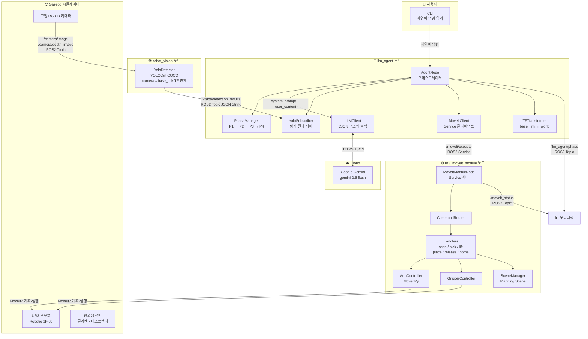
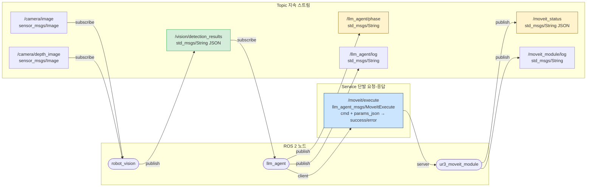
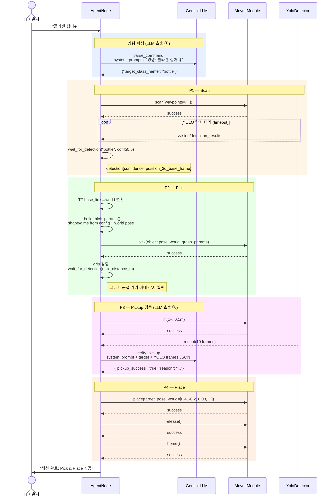
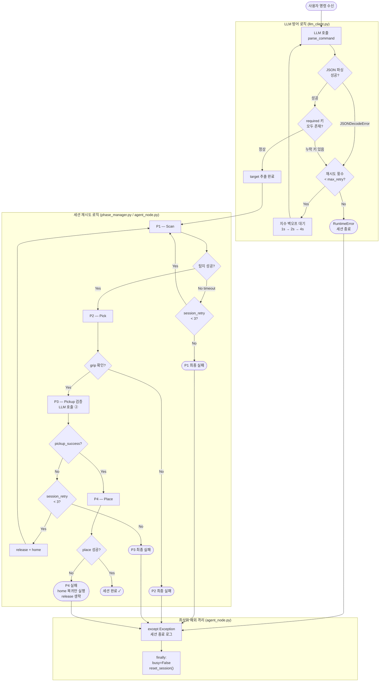

# 시스템 아키텍처 다이어그램

---

## 1. 전체 시스템 구조

---

## 2. ROS 2 노드 · 토픽 · 서비스 통신 구조

---

## 3. Pick & Place 시퀀스 (P1 → P2 → P3 → P4)

---

## 4. LLM 예외 처리 및 세션 재시도 흐름

---

## 다이어그램 범례

| 색상 / 기호 | 의미 |
|---|---|
| 초록 배경 (Topic) | 지속 스트림, 구독-발행 |
| 파랑 배경 (Service) | 단발 요청-응답, 블로킹 |
| 노랑 배경 (Topic) | 모니터링용 상태 발행 |
| `LLM 호출 ①` | `parse_command` — 자연어 → target class |
| `LLM 호출 ②` | `verify_pickup` — YOLO 프레임 → 파지 성공 여부 |
